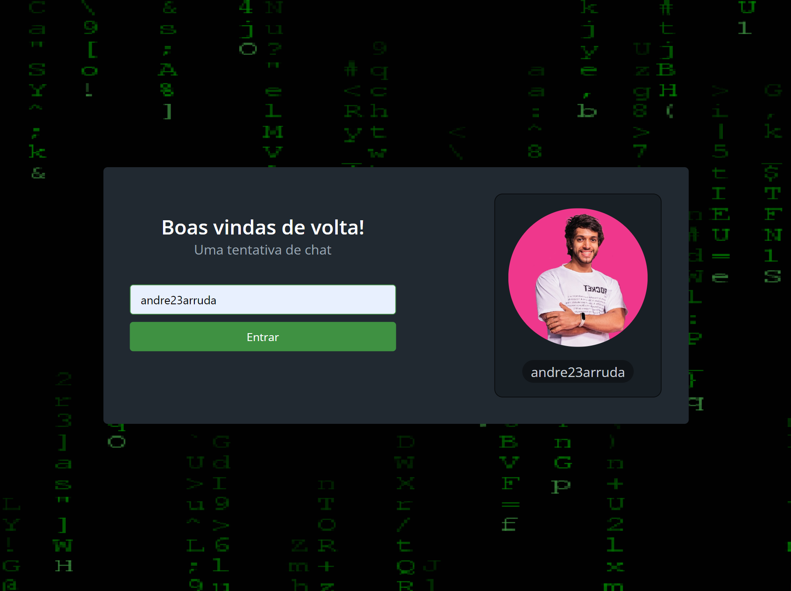

<h1 align="center">
    
</h1>

<h4 align="center">
  🚀 Imersão React - Aluracord
</h4>


<p align="center">
  <a href="#-tecnologias">Tecnologias</a>&nbsp;&nbsp;&nbsp;|&nbsp;&nbsp;&nbsp;
  <a href="#-projeto">Projeto</a>&nbsp;&nbsp;&nbsp;|&nbsp;&nbsp;&nbsp;
  <a href="#instalação">Instalação</a>&nbsp;&nbsp;&nbsp;|&nbsp;&nbsp;&nbsp;
  <a href="#telas">Telas</a>&nbsp;&nbsp;&nbsp;|&nbsp;&nbsp;&nbsp;
  <a href="#exemplo">Exemplo</a>
</p>

## 🚀 Tecnologias

Esse projeto foi desenvolvido com as seguintes tecnologias:

- [Next.js](https://nextjs.org/)
- [Supabase](https://supabase.com/)
- [SkynexUI](https://github.com/skynexui/components)

## 💻 Projeto
**Uma tentativa de chat com Next.JS e Supabase. Projeto desenvolvido na Imersão React da Alura**

## Instalação
### [Supabase](https://supabase.com/)
- Fazer login
- Criar projeto
- Criar banco de dados
- Pegar chaves: URL e anonpublic
- Desabilitar RLS
<div align="center">
    
</div>
- Habilitar Real Time
<div align="center">
    
</div>

### Pré requisitos
Ter instalado:
- [Node](https://nodejs.org/en/download/)
- [Yarn](https://classic.yarnpkg.com/en/docs/install/)

### Clonar projeto
#### No terminal, rodar
```sh
git clone https://github.com/andre23arruda/aluracord

# Entrar na pasta do projeto
cd aluracord

# Instalar os pacotes necessários
yarn install

# Renomear .env_example para .env
cp .env_example.local .env.local
# ADICIONE OS VALORES CORRETOS

# Rodar
yarn dev
```

## Telas
<div align="center">
    
</div>
<p align="center">Login</p>
<hr>

<div align="center">
    
</div>
<p align="center">Login avatar</p>
<hr>

<div align="center">
    
</div>
<p align="center">Chat</p>
<hr>

## Exemplo
<a href="https://andrearruda-discord.vercel.app" target="_blank">Visitar</a>